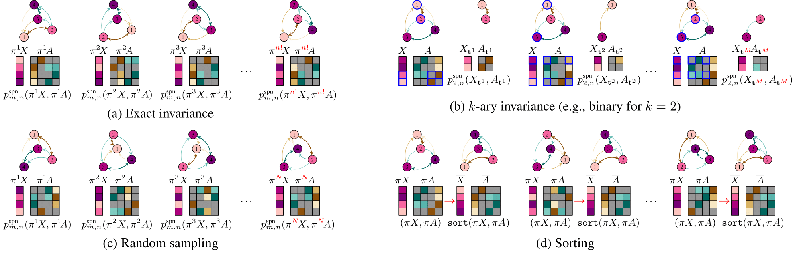
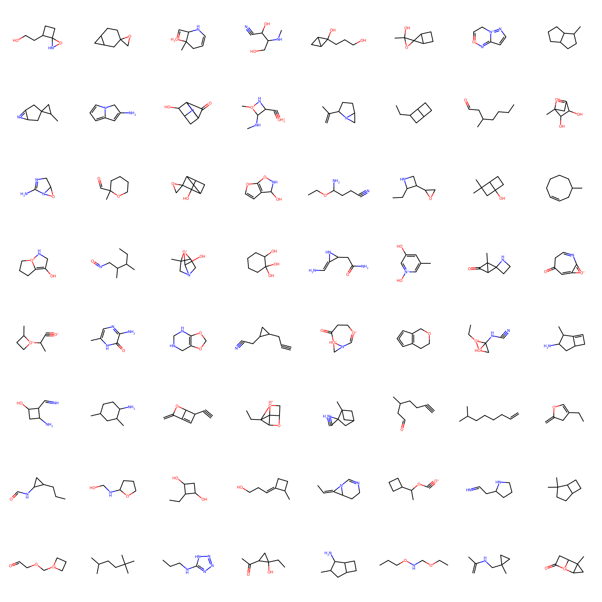
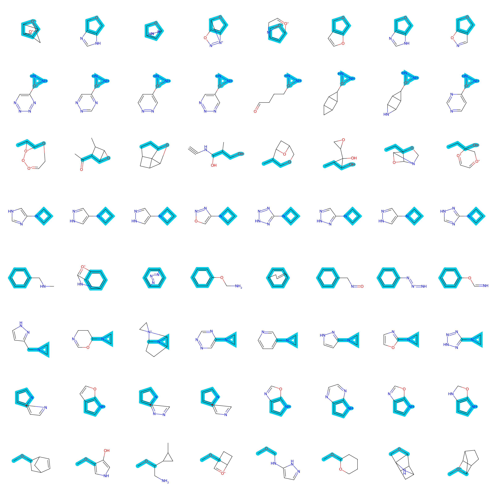

# Graph Sum-Product Networks

This repository contains the code for the following paper: *Papež M, Rektoris M, Šmídl V, Pevný T. [GraphSPNs: Sum-Product Networks Benefit From Canonical Orderings](https://openreview.net/forum?id=NKdl7FHlFK). In The 7th Workshop on Tractable Probabilistic Modeling 2024.*

<!--  -->


*An illustration of the key principles behind various GraphSPNs.* (a) The exact permutation invariance first computes $`p^{\text{spn}}_{m,n}`$ for all $`n!`$ permutations and then averages the results. However, this approach is computationally infeasible even for very small graphs. Therefore, we investigate the following different principles to ensure the permutation invariance. (b) The $`k`$-ary permutation invariance approximates the exact invariance (a) by computing $`p^{\text{spn}}_{k,n}`$ for all ways to choose $`k`$-node sub-graphs from the $`n`$-node original graph, $`G`$, without repetition and with order, and then averaging the $`M={n!}/{(n-k)!}\leq n!`$ results. (c) The random sampling approximates the exact invariance (a) by computing the average only for $`N\lt n!`$ permutations of $`G`$. (d) The sorting approach is also exact, but it simplifies the target data distribution by first imposing the same canonical ordering of $`G`$ and then computing $`p^{\text{spn}}_{m,n}`$.

```
@inproceedings{papez2024graphspns,
 title={Graph{SPN}s: Sum-Product Networks Benefit From Canonical Orderings},
 author={Milan Pape\v{z} and Martin Rektoris and V\'{a}clav \v{S}m\'{i}dl and Tom\'{a}\v{s} Pevn\'{y}},
 booktitle={The 7th Workshop on Tractable Probabilistic Modeling},
 year={2024},
 url={https://openreview.net/forum?id=NKdl7FHlFK}
}
```

## 1. Install

Clone this repository.
```
git clone https://github.com/mlnpapez/GraphSPN GraphSPN
```

Go to the GraphSPN directory.
```
cd GraphSPN
```

Set up the environment.
```
conda create --name graphspn python==3.8.5

source activate graphspn

pip install torch==2.1.2 --index-url https://download.pytorch.org/whl/cu121
pip install rdkit==2022.9.5
pip install tqdm==4.65.0
pip install pandas==2.0.3
pip install pylatex==1.4.2
```

The implementation relies on the [Einsum networks](https://github.com/cambridge-mlg/EinsumNetworks). Run `mkdir einsum` and fill `einsum` with the content of https://github.com/cambridge-mlg/EinsumNetworks/tree/master/src/EinsumNetwork.


## 2. Preprocess
The following command will download and preprocess two versions of the QM9 dataset. `qm9_sort.pt` contains molecules with the canonical ordering of the atoms. `qm9_perm.pt` contains molecules with a random ordering of the atoms.
```
python -m utils.datasets
```
## 3. Train
`config/qm9/` contains JSON files with the GraphSPN variants' hyper-parameters. Change the hyper-parameters based on your preferences and then run the following command.
```
python -m train
```
It will train all the GraphSPN variants (or only the selected ones if you change the list of `names` in `train.py`).

The resulting models will be stored in `results/training/model_checkpoint/`, and the corresponding illustrations of unconditional molecule generation, along with the metrics assessing the performance of the models, will be stored in `results/training/model_evaluation/`.



*Unconditional samples of molecular graphs from the sort variant of GraphSPNs (`graphspn_zero_sort`).*

## 4. Gridsearch
`gridsearch_hyperpars.py` contains hyper-parameter grids to find a suitable architecture for the GraphSPN variants. Change the hyper-parameter grids based on your preferences, and then run the following script.
```
nohup python -m gridsearch > gridsearch.log &
```
This command will run in the background, submitting jobs to your SLURM cluster. The resulting models, metrics, and output logs will be stored in `results/gridsearch/model_checkpoint/`, `results/gridsearch/model_evaluation/`, and `results/gridsearch/model_outputlogs/`, respectively.

To reproduce the results in the paper (Table 1), keep the current settings in `gridsearch_hyperpars.py`. Then, after completing all the SLURM jobs, run the following command.
```
python -m gridsearch_evaluate
```
It will produce Table 1 from the paper (both in the `.pdf` and `.tex` formats).

## 4. Conditional Molecule Generation
To generate new molecules conditionally on a known molecule, run the following command.
```
python -m conditional_sampling
```
To impose a known structure of the generated molecules, change `patt_smls` in `conditional_sampling.py`. Similarly, to select a model from which to generate the samples, change `model_path`.



*Conditional samples of molecular graphs from the sort variant of GraphSPNs (`graphspn_zero_sort`). The known part of a molecule is highlighted in blue.*
